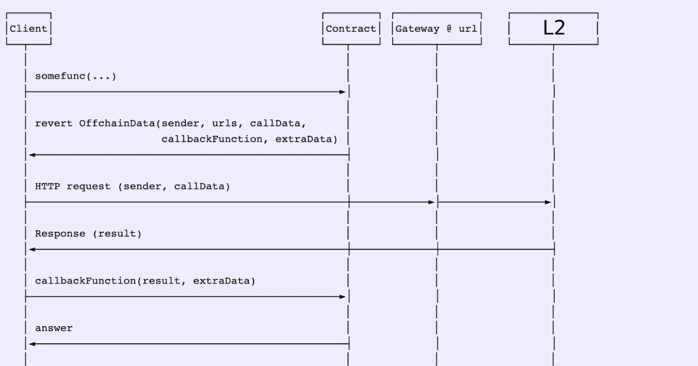

# ENS Offchain Resolver

This repository shows how it is possible to resolve subdomains from an EVM-enabled blockchain based on [EIP 3668](https://eips.ethereum.org/EIPS/eip-3668) and [ENSIP 10](https://docs.ens.domains/ens-improvement-proposals/ensip-10-wildcard-resolution). The goal is to store the second-level domain on the main network while all subdomains attached to it are resolved in another EVM-enabled blockchain.

## Overview

ENS resolution requests to the resolver implemented in this repository are responded to with a directive to query a gateway server for the answer. The gateway server requests the blockchain where the records are stored and signs a response, which is sent back to the original resolver for decoding and verification. Full details of this request flow can be found below.

All of this happens transparently for end users. Offchain resolution is handled by supported clients such as ethers.js.

## [Gateway Server](packages/gateway/readme.md)

The gateway server implements the CCIP Read ([EIP 3668](https://eips.ethereum.org/EIPS/eip-3668)) and responds to requests by searching for names stored on-chain. Once a record is retrieved, it is signed using a predefined key to ensure its validity, then the record and the signature are returned to the caller so that they can be provided to the requesting contract, hosted on the mainnet. More details [here](packages/gateway).

## [Client](packages/client/readme.md)

The client package simulates a dApp or any scripts that would like to resolve an ENS and fetch additional informations. More details [here](packages/client).

## [l1](packages/l1/readme.md)

This package is a minimalist reproduction of ENS' behaviour on the mainnet. In addition, everything needed to be [EIP 3668](https://eips.ethereum.org/EIPS/eip-3668)/[ENSIP 10](https://docs.ens.domains/ens-improvement-proposals/ensip-10-wildcard-resolution) compliant is implemented there. The offchain resolver is defined on the second-level domain which will allow subdomains to be resolved elsewhere. More details [here](packages/l1).

## [l2](packages/l2/readme.md)

Last but not least, this package implements an arbitrary way to store subdomain information on the layer2 side. Contracts defined here are requested by the gateway. In this implementation, we deploy a new registry which will store all the subdomains and we push a ENS-compliant PublicResolver that can be used by subdomains owners to store arbitrary data. More details [here](packages/l2).

## Trying it out

### Init the project

First, install dependencies and build all packages:

```bash
yarn && yarn build
```

Then, run this command to create the .env files you will need

```bash
cp packages/l1/.env.example packages/l1/.env && \
cp packages/gateway/.env.example packages/gateway/.env && \
cp packages/client/.env.example packages/client/.env
```

Now we created the .env files, we'll fill in the right values.

In your terminal, start the l2 package by running

```bash
yarn start:l2
```

Looking at the logs, you should find a line like this:

> Registry address -> 0x5FbDB2315678afecb367f032d93F642f64180aa3

This is the address of the registry deployed on the layer2. Copy this address and paste it as a value for the variable `REGISTRY_ADDRESS` in the [.env file of the gateway package](packages/gateway/.env). The gateway needs it to know which contrat fetch.

Stop the l2 package. As you can see in the .env file of the gateway, the gateway needs a private key to works. This private key will be used as a signing key for any messages signed by your gateway service. It is important to ensure the data is unaltered.

For the demo purpose, I would suggest you to generate a new private key. You can use a variety of tools for this; for instance, this Python snippet will generate one for you:

```bash
python3 -c "import os; import binascii; print('0x%s' % binascii.hexlify(os.urandom(32)).decode('utf-8'))"
```

> Do not send mainnet tokens to any account addresses derived using this private key. Consider this private key as publicly known. If you add any of those accounts to a wallet (eg Metamask), be very careful to avoid sending any mainnet Ether to them: consider naming the account something like "Unsafe" in order to prevent any mistakes.

Once your private key is generated, paste it as a value for the variable `PRIVATE_KEY` in the [.env file of the gateway package](packages/gateway/.env).

We now have all we need to start the gateway package! Start it by running:

```bash
yarn start:gateway
```

The gateway is up! In the output of the script, the signer address has been printed. This address is derived from the private key filled in your .env file. We need to push it on-chain on the l1 to check if the received data are from the gateway. Let's copy/paste this address and set it as a value for the `SIGNER` envionment variable in the [.env file of the l1 package](/packages/l1/.env).

Now that the signer address is filled in, stop the gateway and start the l1 package by running:

```bash
yarn start:l1
```

Once again, running the l1 printed something interesting. In the log, you'll find a line like this:

> Registry address -> 0x5FbDB2315678afecb367f032d93F642f64180aa3

This is the address of the registry published on the l1. This is only required for the demo, in production, you will use the official registry deployed by ENS instead of deploying yours. Copy this value and paste it as a value for the variable `REGISTRY_ADDRESS` in the [.env file of the client package](packages/client/.env). The client needs it to know which contrat request.

That's it, everything is configured. Let's up the stack now.

### Run the project

Open 4 different terminal instances at the root of the repository.

In the first one, up the layer1 network by running:

```bash
yarn start:l1

# `yarn start` if you are in the directory of the package
```

In the second one, up the layer2 network by running:

```bash
yarn start:l2

# `yarn start` if you are in the directory of the package
```

In the third one, up the gateway by running:

```bash
yarn start:gateway

# `yarn start` if you are in the directory of the package
```

Finally, in the last instance, you can run the client's script to test the setup. You need to pass an ENS as a parameter of the command to test the flow. First, try to resolve a ENS that is not a subdomain of `mydao.eth` by running:

```bash
yarn start:client aloha.eth
```

These informations should be printed:

```
-> L1 informations
  l1 offchain resolver address: undefined
  eth address: null
```

That means the script works as expected. The script wasn't able to find an owner for the ENS you passed, because it doesn't exist on our local network. This ENS is still free to register.

Now, let's try to resolve a subdomain of the `mydao.eth` that has not been registered on the l2. For example by running:

```bash
yarn start:client aloha.mydao.eth
```

These informations should be printed:

```
-> L1 informations
  l1 offchain resolver address: 0x8464135c8F25Da09e49BC8782676a84730C318bC
  eth address: null
```

This is because the script correctly find the custom mydao's resolver but the subdomain is free in the registry stored in the layer2.

Let's see what happens if you resolve `myname.mydao.eth`, the subdomain registered on the layer2 by the [deployment script](packages/l2/deploy/10_setup_l2.js).

```bash
yarn start:client myname.mydao.eth
```

```
-> L1 informations
  l1 offchain resolver address: 0x8464135c8F25Da09e49BC8782676a84730C318bC
  eth address: 0x70997970C51812dc3A010C7d01b50e0d17dc79C8

-> Data fetched from the layer2 resolver
  eth address: 0x70997970C51812dc3A010C7d01b50e0d17dc79C8
  btc address: bc1q8fnmuy9cfzmym062a93cuqh2l8l0p46gxy74pg
  doge address: DBs4WcRE7eysKwRxHNX88XZVCQ9M6QSUSz
  twitter account: qdqd___
  content hash: ipfs://QmdTPkMMBWQvL8t7yXogo7jq5pAcWg8J7RkLrDsWZHT82y
  avatar: https://metadata.ens.domains/mainnet/avatar/qdqdqd.eth?v=1.0
  twitter: qdqd___
  github: qd-qd
  telegram: qd_qd_qd
  email: qdqdqdqdqd@protonmail.com
  url: https://ens.domains/
  description: smart-contract engineer
  notice: This is a custom notice
  keywords: solidity,ethereum,developer
  company: ledger
```

It works! Every data set during the deployement process ([this file](packages/l2/deploy/11_resolver_l2.js)) have been resolve as expected. The script correctly found the custom offchain resolver set in the layer1 for mydao, discovered the subdomain is owned and fetched all the data requested by the script. Note that the address displayed in the output should match the address of the first account printed when you run the command (`yarn start:l2`). This is because we use this account to register the `myname.mydao.eth` node as you can see in this file [`packages/contracts/deploy/10_offchain_resolver.js`](packages/l2/deploy/10_setup_l2.js).

## Appendix

### Transaction flow



### Ressources

#### Improvement proposals

- [Nick Johnson](https://github.com/arachnid), "EIP-137: Ethereum Domain Name Service - Specification," Ethereum Improvement Proposals, no. 137, April 2016, [Link](https://eips.ethereum.org/EIPS/eip-137)
- [Nick Johnson](https://github.com/arachnid), "EIP-181: ENS support for reverse resolution of Ethereum addresses," Ethereum Improvement Proposals, no. 181, December 2016, [Link](https://eips.ethereum.org/EIPS/eip-181).
- [Richard Moore](https://github.com/ricmoo), "EIP-634: Storage of text records in ENS [DRAFT]," Ethereum Improvement Proposals, no. 634, May 2017, [Link](https://eips.ethereum.org/EIPS/eip-634)
- [Dean Eigenmann](https://github.com/arachnid), [Nick Johnson](https://github.com/arachnid), "EIP-1577: contenthash field for ENS," Ethereum Improvement Proposals, no. 1577, November 2018, [Link](https://eips.ethereum.org/EIPS/eip-1577)
- [Nick Johnson](https://github.com/arachnid), "EIP-2304: Multichain address resolution for ENS," Ethereum Improvement Proposals, no. 2304, September 2019, [Link](https://eips.ethereum.org/EIPS/eip-2304)
- [Nick Johnson](https://github.com/arachnid), "EIP-3668: CCIP Read: Secure offchain data retrieval," Ethereum Improvement Proposals, no. 3668, July 2020, [Link](https://eips.ethereum.org/EIPS/eip-3668)
- [Nick Johnson](https://github.com/arachnid), "EIP DRAFT: Storage of SECP256k1 public keys in ENS," Ethereum Improvement Proposals, [Link](https://github.com/Arachnid/EIPs/blob/56cce2377d4b1f38632315a6aa71ac980202f9cf/EIPS/eip-draft-ens-public-keys.md)
- [Nick Johnson](https://github.com/arachnid), [0age](https://github.com/0age), "ENSIP-10: Wildcard Resolution," ENS Improvement Proposals, no. 10, February 2022, [Link](https://docs.ens.domains/ens-improvement-proposals/ensip-10-wildcard-resolution)
- [Nick Johnson](https://github.com/arachnid), "EIP-1844: ENS Interface Discovery," Ethereum Improvement Proposals, no. 1844, March 2019. [Link](https://eips.ethereum.org/EIPS/eip-1844)
- [Dean Eigenmann](mailto:dean@ens.domains), [Nick Johnson](mailto:nick@ens.domains), "EIP-1577: contenthash field for ENS," Ethereum Improvement Proposals, no. 1577, November 2018. [Link](https://eips.ethereum.org/EIPS/eip-1577).

#### Documentation

- [ENS: Name Processing](https://docs.ens.domains/contract-api-reference/name-processing)
- [ENS: Registry](https://docs.ens.domains/contract-api-reference/ens)
- [ENS: ReverseRegistrar](https://docs.ens.domains/contract-api-reference/reverseregistrar)
- [ENS: PublicResolver](https://docs.ens.domains/contract-api-reference/publicresolver)
- [ENS: Permanent Registar](https://docs.ens.domains/contract-api-reference/.eth-permanent-registrar)
- [ENS: Layer2 and offchain data support](https://docs.ens.domains/dapp-developer-guide/ens-l2-offchain)
- [ENS as NFT](https://docs.ens.domains/dapp-developer-guide/ens-as-nft#metadata)
- [vbuterin: A general-purpose L2-friendly ENS standard](https://ethereum-magicians.org/t/a-general-purpose-l2-friendly-ens-standard/4591)

#### Others

- [ENS Contracts repository](https://github.com/ensdomains/ens-contracts)
- [General-Purpose Layer 2 Static-Calls Proposal Presentation by Vitalik Buterin at ENS Online Workshop 2020](https://www.youtube.com/watch?v=65z_j4n8mTk)
